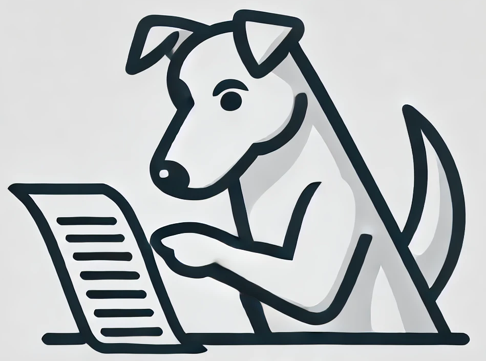

<p align="center">
  
</p>

# AI Watchdog GitHub Action

This action analyzes pull request changes to detect AI-generated code and comments on the PR with its findings. It helps maintain transparency about AI-assisted contributions in your codebase.

## Usage

Add this action to your workflow to automatically scan pull requests for AI-generated code:

```yaml
name: AI Detection
on: [pull_request]
jobs:
  detect-ai:
    runs-on: ubuntu-latest
    steps:
      - uses: actions/checkout@v4
      - name: AI Watchdog
        uses: Citric-Sheep/ai-watchdog@v1
        with:
          openai-api-key: ${{ secrets.OPENAI_API_KEY }}
          token: ${{ secrets.GITHUB_TOKEN }}
```

## Inputs

| Input | Description | Required | Default |
|-------|-------------|----------|---------|
| openai-api-key | OpenAI API key for AI detection | Yes | N/A |
| token | GitHub token used to fetch and comment on PRs | No | ${{ github.token }} |

## How It Works

1. When a pull request is opened or updated, the action:
   - Analyzes the changed files
   - Uses OpenAI's models to detect AI-generated code
   - Comments on the PR with its findings
   - Labels the PR if AI-generated code is detected

2. The comment will include:
   - Overall confidence score
   - Files that appear to be AI-generated
   - Suggestions for documentation/attribution

## Example Workflow

```yaml
name: AI Detection
on: [pull_request]
jobs:
  detect-ai:
    runs-on: ubuntu-latest
    steps:
      - uses: actions/checkout@v4
      - name: AI Watchdog
        uses: Citric-Sheep/ai-watchdog@v1
        with:
          openai-api-key: ${{ secrets.OPENAI_API_KEY }}
```

## Contributing

Contributions are welcome! Please feel free to submit a Pull Request.

## License

This project is licensed under the MIT License - see the LICENSE file for details.
